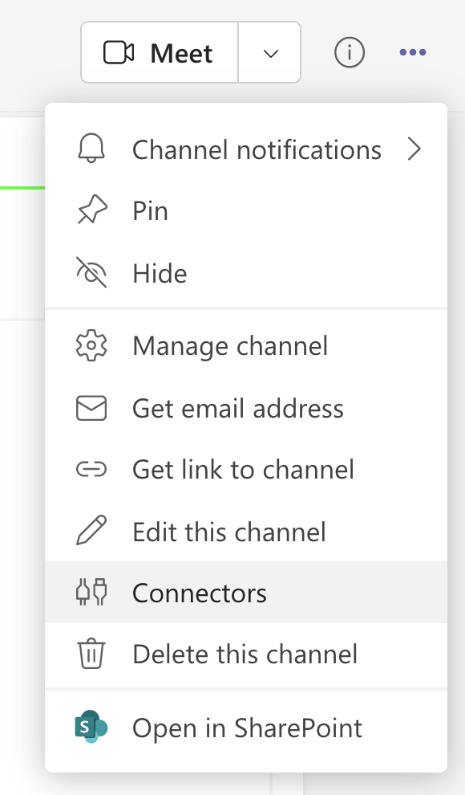
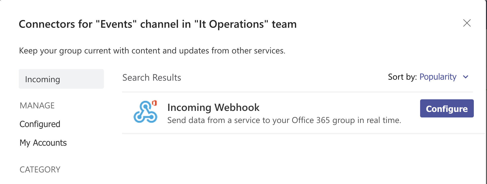
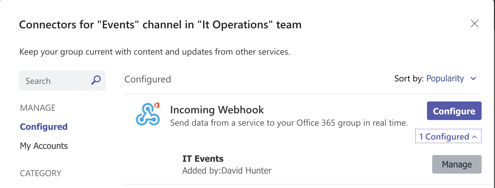
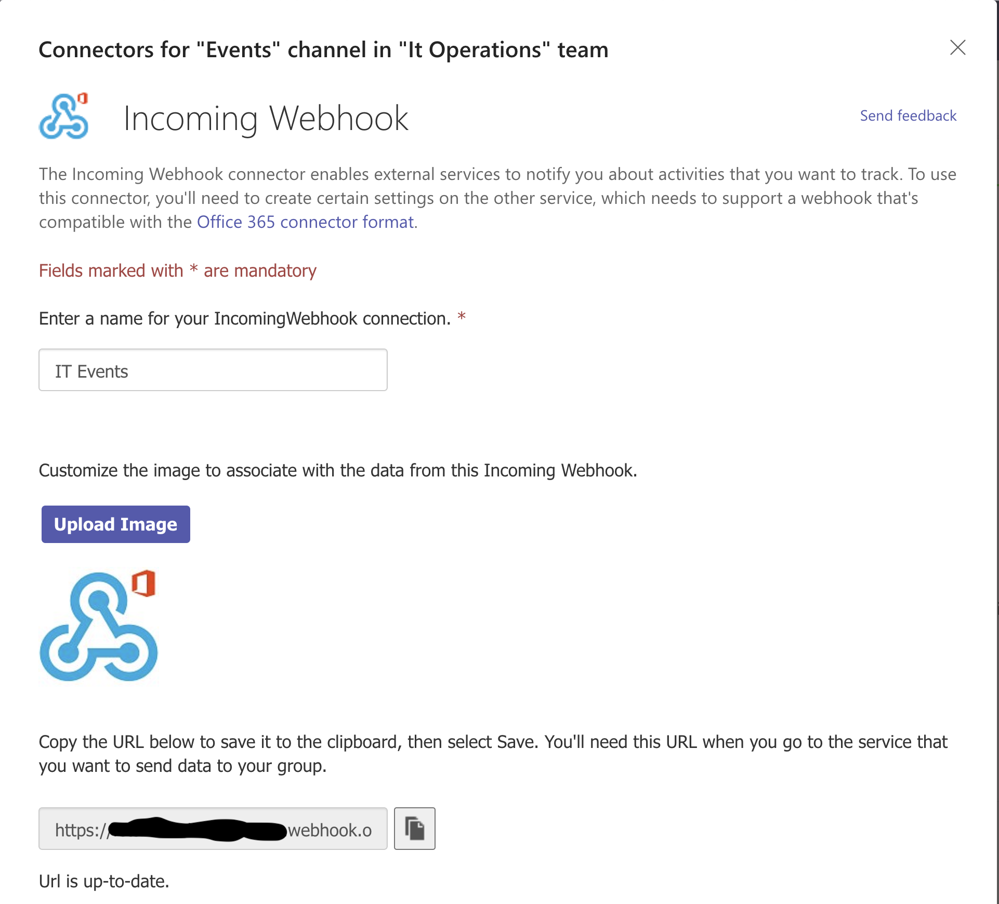
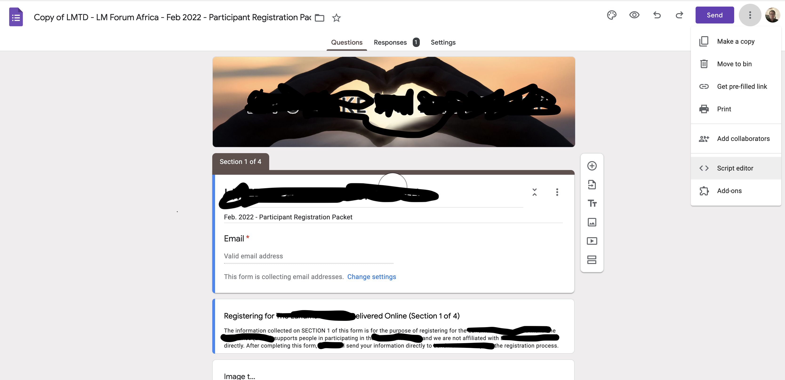
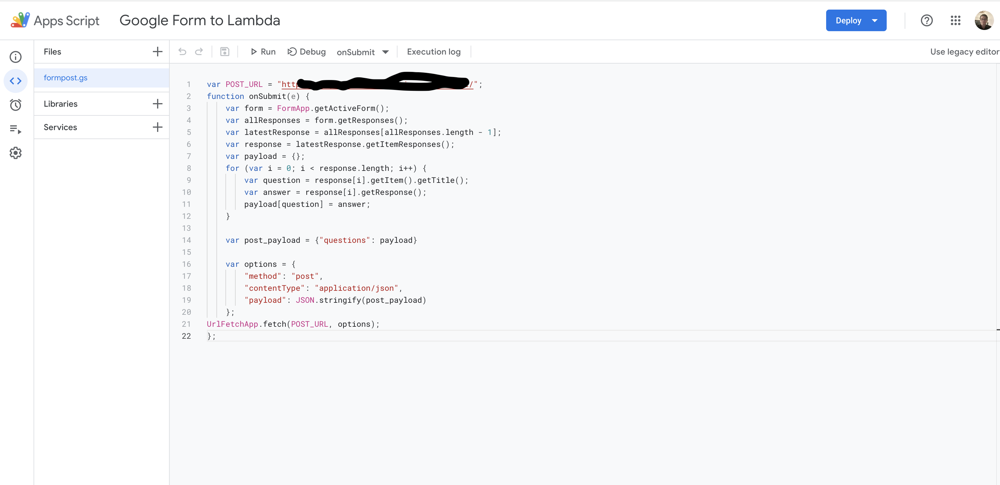
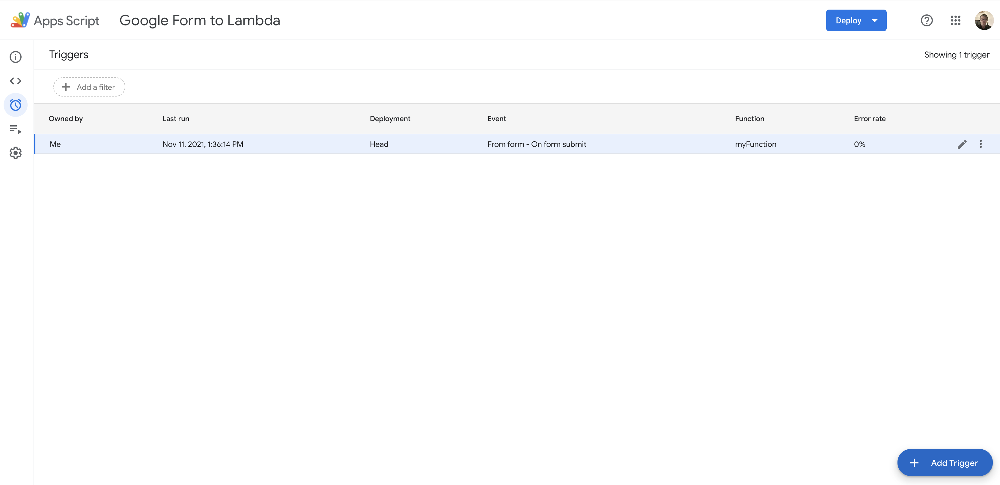
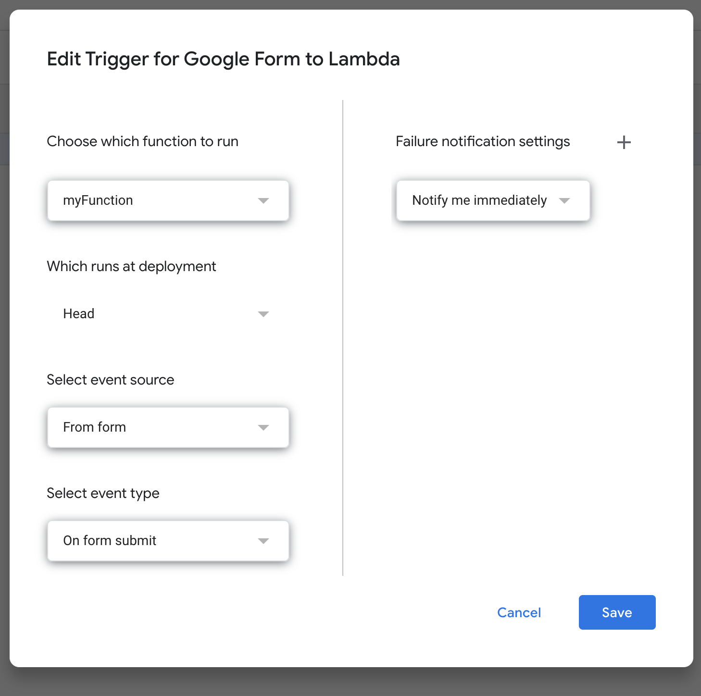
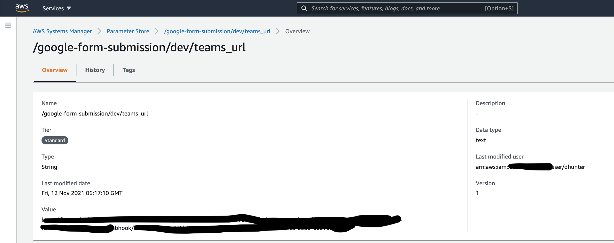
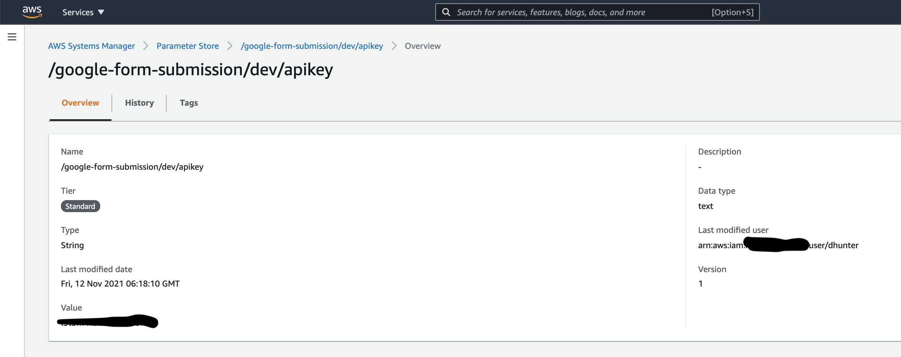

# Setups

[Microsoft Teams - Webhook](#webhook)

[Google Forms - App Script](#appscript)

[AWS System Manager - Parameter Store](#awsssm)

## <a name="webhook">Microsoft Teams - Webhook</a>

* Edit the teams channel connectors

* Search for and configure a new webhook

* Edit an existing Webhook

* Get the webhook URL

## <a name="appscript">Google Forms - App Script</a>

App Script setup to push form questions at the rest api

1. Open the app script editor

2. Add the <a href="appscript.txt" parent="_top">new script</a> for the current form

3. Add a trigger on submit to send the data to the api

## <a name="awsssm">AWS Parameter Store</a>

